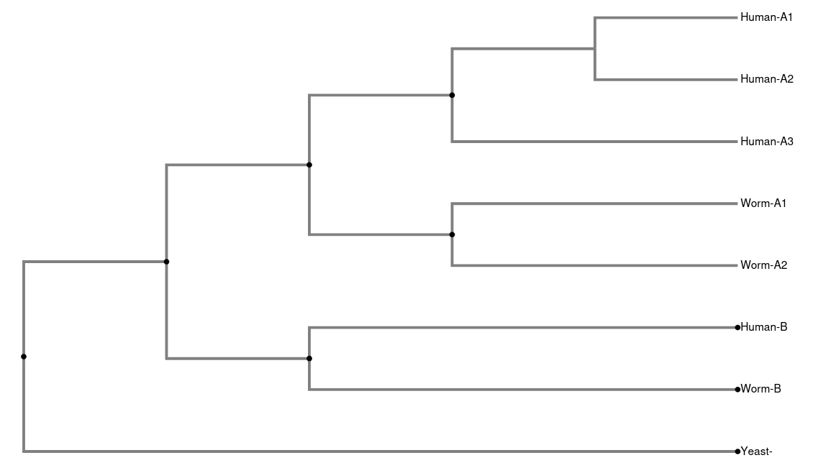

# OrthoParaTool

## Dependencies

Dendropy 5.0.1

## Conda Environment

To build the exact conda environment run

`conda create --name [environment name] --file specs/spec-file.txt`

## Help function to list arguments

`python ortho_para_tool.py -h`

## Example

The example in `./sonnhammer_example.tree` is an example of the figure in [1] and is the newick format of the following tree:

To label the tree with our tool run

`python ortho_para_tool.py --input ./example_trees/sonnhammer_example.tree --output example_output/sonnhammer_output_ --sep -`

This will output several text files in the `./example_output` of the format `sonnhammer_output_[OTU].csv`.

For example, `sonnhammer_output_HumanA1.csv` is a csv of the following table

|taxon   |relationship|extra_info    |
|--------|------------|--------------|
|Human-A2|paralogous  |in-paralogous |
|Human-A3|paralogous  |in-paralogous |
|Worm-A1 |orthologous |              |
|Worm-A2 |orthologous |              |
|Human-B |paralogous  |out-paralogous|
|Worm-B  |paralogous  |out-paralogous|
|Yeast-  |orthologous |              |

which contains labels of the relationships between Human-A1 and all other OTUs in the tree. 

In this example we see that Human-A1 and Worm-A2 are orthologous. In fact the Human-A* set is co-orthologous with the Worm-A* set, so all pairs between the two are labeled orthologous to represent this.

For paralogous relationship, extra information may be given on whether or not two OTU's are in/out-paralogous. In this example Human-A1 and Worm-B are out-paralogous, and Human-A2 and Human-A2 are in-paralogous. 

## References
[1] Sonnhammer EL, Koonin EV. Orthology, paralogy and proposed classification for paralog subtypes. Trends Genet. 2002 Dec;18(12):619-20. doi: 10.1016/s0168-9525(02)02793-2. PMID: 12446146.
